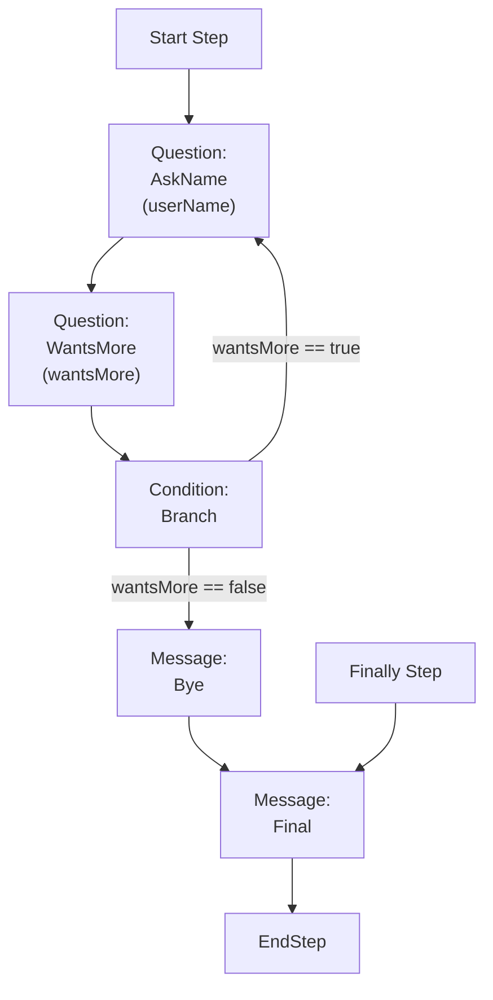

# Parsing Mermaid Flowcharts into Business Scenarios

The Critical Manufacturing VS Code extension renders business scenarios as mermaid flowcharts with a consistent shape. Reverse-engineering them follows fixed rules.

## Anatomy of a node

```
<Name>["<Type>:
<Name>
(<resultKey>)"] --> <NextNodeName>
```

- Line 1 of the label: `<Type>:` — one of `Message`, `Question`, `Script`, `Condition`, `Foreach`, `CallScenario`, `Debug`.
- Line 2: the step `name`, identical to the node id used in the graph.
- Line 3 (optional, in parens): the `resultKey`.

The node id outside the brackets is the step `name`. You use it on both sides of every `-->` edge.

## Anatomy of an edge

| Edge form | Meaning |
|---|---|
| `A --> B` | `A.next = "B"` |
| `A -->\|"<expr>"\|B` | A is a `Condition`; `settings.condition["<expr>"] = "B"`. |
| `A --> StepExecution["End Step Execution"]:::startClass` | `A.next = ""` — the flow ends here naturally. |
| `StartStep["Start Step"]:::startClass --> X` | `metadata.start = "X"`. |
| `FinallyStep["Finally Step"]:::finallyClass --> X` | `metadata.finally = "X"`. |
| `EndStep["End Step"]:::endClass --> X` | `metadata.end = "X"`. |

## Class definitions to ignore

These lines are styling only and don't affect the JSON:

```
classDef startClass fill: #007ac9, color:#000000;
classDef finallyClass fill: #50b450, color:#000000;
classDef endClass fill: #3b8b3b, color:#000000;
```

## Worked example

Input flowchart:



Resulting JSON skeleton (the user must still provide name/scopes/dataType for the Boolean question, etc.):

```json
{
  "name": "Greeting Loop",
  "description": "Asks for a name and loops until the user is done.",
  "scopes": "Custom",
  "conditionType": "JSONata",
  "condition": "",
  "metadata": {
    "start": "AskName",
    "finally": "Final",
    "resultType": "Custom",
    "steps": [
      {
        "name": "AskName",
        "type": "Question",
        "resultKey": "userName",
        "settings": { "message": "What's your name?", "dataType": "String" },
        "next": "WantsMore"
      },
      {
        "name": "WantsMore",
        "type": "Question",
        "resultKey": "wantsMore",
        "settings": { "message": "Add another?", "dataType": "Boolean" },
        "next": "Branch"
      },
      {
        "name": "Branch",
        "type": "Condition",
        "settings": {
          "condition": {
            "wantsMore == true": "AskName",
            "wantsMore == false": "Bye"
          }
        },
        "next": ""
      },
      {
        "name": "Bye",
        "type": "Message",
        "settings": { "message": "Goodbye!" },
        "next": ""
      },
      {
        "name": "Final",
        "type": "Message",
        "settings": { "message": "All done." },
        "next": ""
      }
    ]
  }
}
```

## Common mermaid quirks to handle

- Labels span multiple lines inside `"..."`. Treat newlines inside the label as part of the same node definition.
- A node may be repeated on the left side of multiple edges. Deduplicate — only one entry per `name` in `steps`.
- The mermaid graph sometimes points to a synthetic node like `StepExecution["End Step Execution"]` to indicate "no next step". Map this to `"next": ""`.
- Condition fallback (`next` on the Condition step itself) is rarely shown in the mermaid; default it to `"Error"` and add an `Error` script step that throws, unless the user states otherwise.
- If the flowchart shows the **end** of a flow with `EndStep --> X`, that `X` is the `metadata.end` step (it runs *after* the `resultType`-driven user confirmation).
