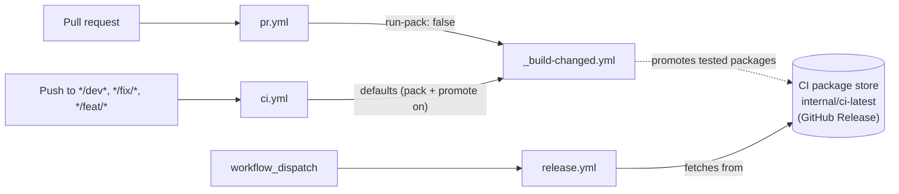
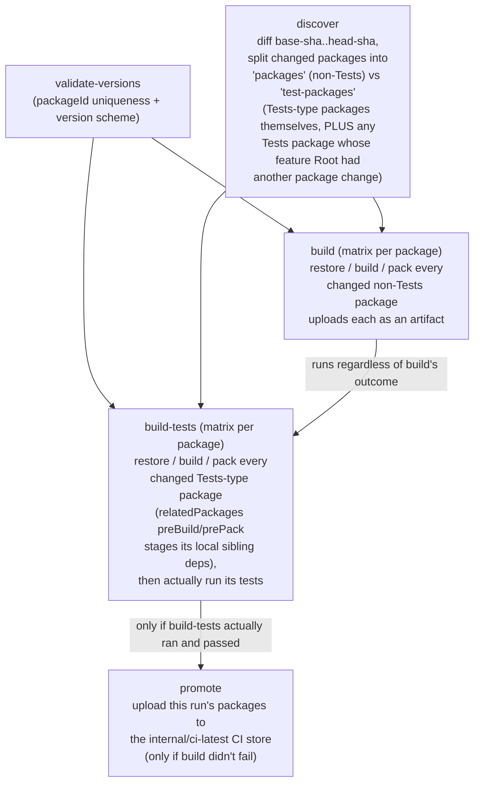
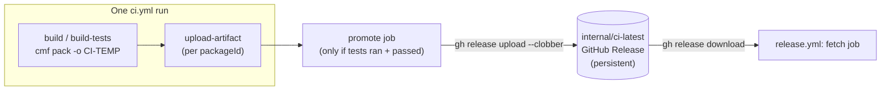
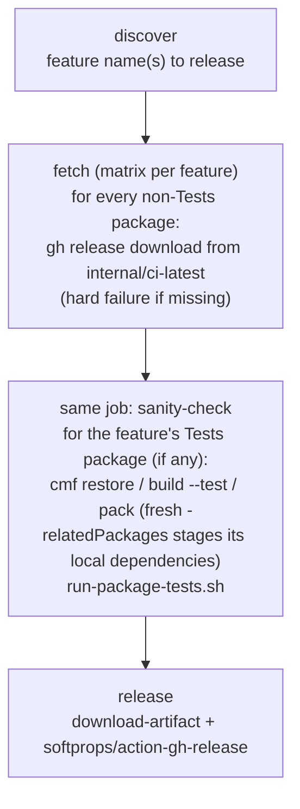

# CI/CD pipeline

This directory implements the repo's build/test/release pipeline. It's built around one core idea:

> **Build once, test once, then reuse.** A package is built and packed when it changes, tested if it's a `Tests`-type package, and — only once a real test pass has vetted it — promoted into a persistent store. `release.yml` then never rebuilds anything: it fetches already-tested packages from that store and only re-runs the test package(s) as a final sanity check.

## Files

| File | Role |
|---|---|
| [`pr.yml`](pr.yml) | Trigger: pull requests. Validates a PR's changed packages build (no packing, no promotion). |
| [`ci.yml`](ci.yml) | Trigger: push to `*/dev*`, `*/fix/*`, `*/feat/*`. Builds, packs, tests, and **promotes** changed packages. |
| [`_build-changed.yml`](_build-changed.yml) | Reusable workflow shared by `pr.yml`/`ci.yml`. Does the actual discover → build → test → promote work. |
| [`release.yml`](release.yml) | Trigger: manual (`workflow_dispatch`). Fetches already-tested packages from the CI store and publishes a GitHub Release. |
| [`../scripts/`](../scripts/) | Shell scripts shared across the workflows above (see [Scripts](#scripts) below). |

## Trigger map



`pr.yml` and `ci.yml` call the *same* reusable workflow with different inputs — a PR only needs to prove the diff still builds, so it skips packing (and therefore skips promotion too, since there's nothing to promote). A push to a working branch does the full thing, including publishing to the CI store.

## `_build-changed.yml`: discover → build → test → promote



Two things worth calling out because they're easy to misread from the YAML alone:

- **`build-tests` doesn't wait on `build` to succeed — only to finish.** Its `if:` accepts `build`'s result being `success` *or* `skipped`, and deliberately ignores `failure`. That's intentional: a Tests-type package's own build/test run is independent of whatever else changed in the same push.
- **A Tests package runs whenever its feature is touched, not just when the Tests package itself changes.** `discover` resolves each changed package's feature Root and checks that Root's `testPackages` field — so changing `IoTMTConnect.IoT` alone is enough to re-run `IoTMTConnect.Tests`, exactly as if `IoTMTConnect.Tests` had changed directly. A feature with no `Tests`-type package (or no `testPackages` entry) never adds anything to `test-packages`, no matter what changes.
- **`promote` is the strict one.** It only fires when `build-tests` genuinely executed and passed (not skipped, not failed) *and* `build` didn't fail. So a package only reaches the persistent CI store once its feature's Tests package has actually re-validated the change alongside it.

### How a Tests package gets its local sibling dependencies

A `Tests`-type package's own test run often needs a sibling package's build output on disk (e.g. `IoTMTConnect.Tests` needs `IoTMTConnect.IoT`'s pack output, via `scripts/pack-iot-test-packages.sh`). That's declared once, on the Tests package's own `cmfpackage.json`, via `relatedPackages`:

```json
"relatedPackages": [
  { "path": "../IoTMTConnect.IoT", "preBuild": true, "prePack": true }
]
```

`preBuild`/`prePack` mean exactly what they say: before `cmf build`/`cmf pack` runs on `IoTMTConnect.Tests`, cmf builds/packs `../IoTMTConnect.IoT` first, landing its zip at `IoTMTConnect.Tests/Package/<packageId>.<version>.zip` — the same location `scripts/pack-iot-test-packages.sh`'s `iotTestPackages` config already points at. `build-tests` always runs both `cmf build --test` and `cmf pack` for a changed Tests package (regardless of the `run-pack` input - see Workflow inputs below), and `release.yml`'s sanity-check does the same, so that sibling is always freshly staged, in the same isolated runner/checkout, with no cross-job artifact shipping needed.

## The CI package store

There are two tiers of "already built":

- **`CI-TEMP`** — this run's own staging area (`$GITHUB_WORKSPACE/CI-TEMP`, uploaded as a per-package GitHub Actions artifact). Ephemeral: it dies with the workflow run.
- **`internal/ci-latest`** — a hidden, prerelease **GitHub Release** that acts as a persistent, cross-run store. One zip asset per package (`<packageId>.<version>.zip`), overwritten (`gh release upload --clobber`) every time a package is promoted. It has no expiry (unlike Actions artifacts' ~90-day retention) and survives independently of any single workflow run.



**Only promoted packages are trusted.** `release.yml` never rebuilds a package from source — if it needs a package that was never promoted (no `ci.yml` run has ever built *and tested* it), it fails loudly rather than silently falling back to a fresh build. That failure means: push a change that touches this package and let `ci.yml` run before releasing — since a package change also re-triggers its feature's Tests package (see above), the promotion gate fires on its own as long as the feature has one.

## `release.yml`: fetch → sanity-check → publish



The Tests-type package is the one exception to "never rebuild": it's cheap to build, isn't customer-facing (`isInstallable: false`), and re-running it right before publishing is the last real signal that the specific combination of packages about to ship actually works together. If that sanity check fails, the job fails and — because `release` needs `fetch` — no GitHub Release gets created for that feature.

## Scripts

| Script | Used by | Purpose |
|---|---|---|
| [`validate-package-ids-versions.sh`](../scripts/validate-package-ids-versions.sh) | `_build-changed.yml` (`validate-versions`) | Every `packageId` is unique repo-wide; every package's version matches its feature's MES-derived prefix. |
| [`promote-to-ci-store.sh`](../scripts/promote-to-ci-store.sh) | `_build-changed.yml` (`promote`) | Uploads a run's tested packages to `internal/ci-latest`, creating the release if needed and pruning stale same-package/different-version assets. |
| [`run-package-tests.sh`](../scripts/run-package-tests.sh) | `build-tests`, `release.yml` | The actual test-execution logic for a `Tests`-type package (packs IoT runtime deps, runs every MSTest/xUnit/NUnit assembly via `dotnet-test-rerun`). Shared so both callers run identical logic. |
| [`pack-iot-test-packages.sh`](../scripts/pack-iot-test-packages.sh) | `run-package-tests.sh` | Assembles the local `IoTRepository/` used by `cmf dev iot rebuildDatabase`, from the repo root `package.json`'s `iotTestPackages` list (registry specs + the local sibling zip staged via the Tests package's own `relatedPackages` prePack hook). |

## Workflow inputs (`_build-changed.yml`)

| Input | `pr.yml` | `ci.yml` | Effect |
|---|---|---|---|
| `run-restore` | *(default `true`)* | *(default `true`)* | Gates `cmf restore`. |
| `run-build` | *(default `true`)* | *(default `true`)* | Gates `cmf build --test`. |
| `run-pack` | `false` | *(default `true`)* | Gates `cmf pack` for non-Tests packages in `build`, the CI-TEMP artifact upload, **and** the `promote` job (nothing to promote if nothing was packed). Does **not** gate `build-tests`: a Tests package always packs, since that's what stages its `relatedPackages` sibling dependencies. |
| `run-tests` | *(default `true`)* | *(default `true`)* | Gates actually running a Tests-type package's test suite, **and** the `promote` job. |

## Permissions

`ci.yml` declares `permissions: contents: write` — required for the `promote` job's `gh release create/upload` against `internal/ci-latest`. `pr.yml` deliberately has no elevated permissions: `run-pack: false` already keeps `promote`'s `if:` false, so PR runs (including from forks) never attempt a release-asset write.

## Troubleshooting

- **`scripts/pack-iot-test-packages.sh` can't find a sibling's zip** — check that the Tests package's `cmfpackage.json` actually declares that sibling under `relatedPackages` with `preBuild`/`prePack: true`, and that its own `cmf build`/`cmf pack` step actually ran (see the `run-pack` row above — it doesn't gate `build-tests`, but a `run-build: false` caller would skip both).
- **`release.yml` fails at "Fetch already-tested packages"** — the feature has a package that was never promoted to `internal/ci-latest`. Run `ci.yml` against it first (see above); `release.yml` intentionally never falls back to rebuilding from source.
- **A package's version bumped and the old zip is still on `internal/ci-latest`** — it shouldn't be: `promote-to-ci-store.sh` deletes any other-version asset for the same `packageId` before uploading the new one. If it's still there, the promotion for the new version hasn't happened yet.
