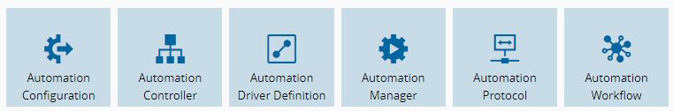
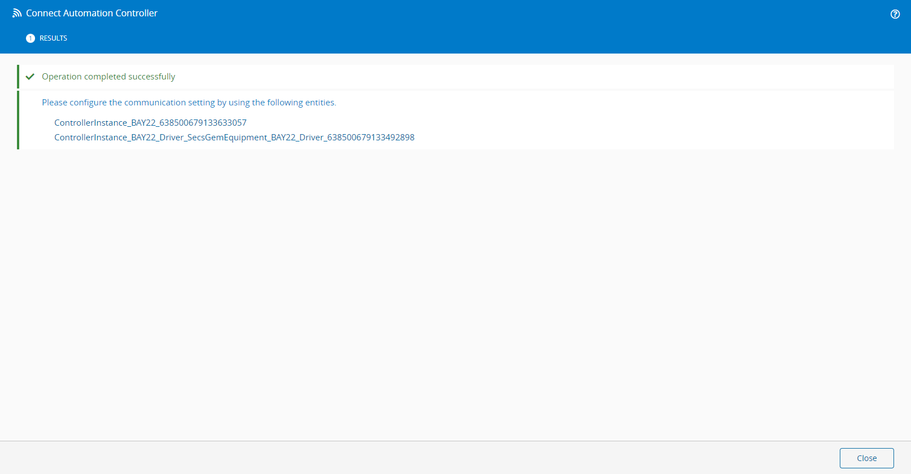
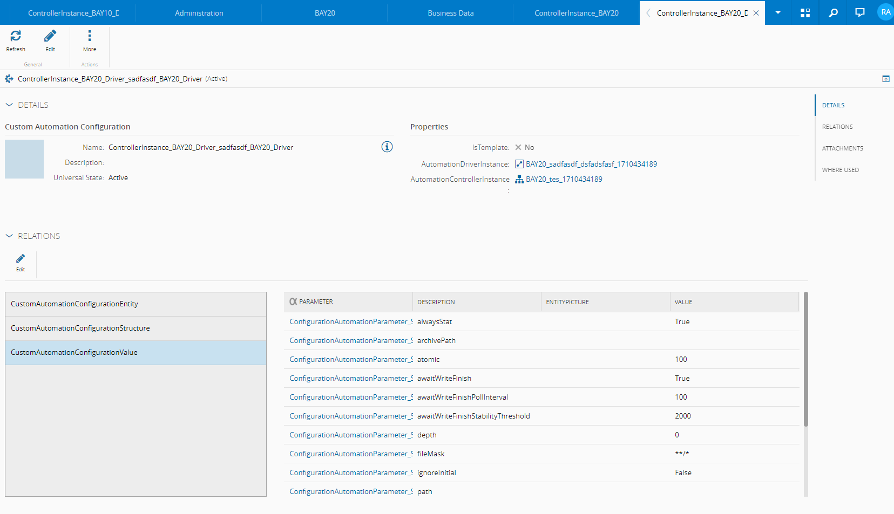
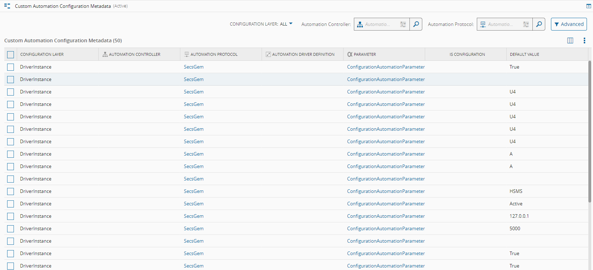
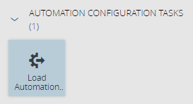
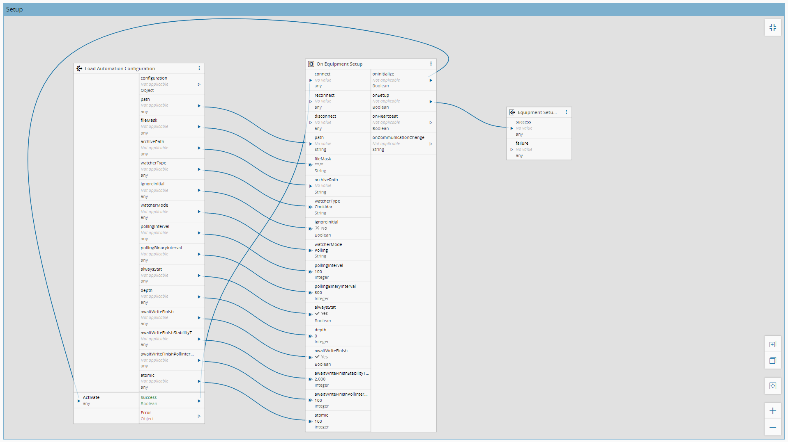

# IoT Custom Automation Configuration

A Critical Manufacturing MES Community feature that lets IoT-connected equipment (via Connect IoT controllers and drivers) store, retrieve, and apply custom automation configuration data through standard MES entity relationships. It gives MES a data model and server-side logic for describing per-equipment automation parameters (e.g. driver/controller settings, material-movement context, sorter job definitions, error handling and alarm-management rules), and gives Connect IoT flows a task that loads that configuration at runtime and persists it locally for use in device automation workflows.

This directory is the feature root: a single installable `Root` package (`cmfpackage.json`, `packageId: Cmf.Community.IoTCustomAutomationConfiguration`) that bundles three installable sub-packages — one per MES tier.

| Package | Package type | Purpose |
| --- | --- | --- |
| `Cmf.Community.IoTCustomAutomationConfiguration` | `Root` | Deployment wrapper that installs the feature and its three tier packages together. |
| [`Cmf.Community.IoTCustomAutomationConfiguration.Business`](IoTCustomAutomationConfiguration.Business/) | `Business` | Server-side .NET orchestration and HTTP API for creating, retrieving, and updating automation configuration metadata and entities. |
| [`Cmf.Community.IoTCustomAutomationConfiguration.Data`](IoTCustomAutomationConfiguration.Data/) | `Data` | Master data, DEE (Dynamic Entity Extension) rules, entity-type extensions, and process-rule hooks that define the automation configuration data model. |
| [`Cmf.Community.IoTCustomAutomationConfiguration.IoT`](IoTCustomAutomationConfiguration.IoT/) | `IoT` | Connect IoT task (`LoadAutomationConfigurationTask`) and deployment wizard UI that retrieve and persist automation configuration on the controller side. |

## Introduction

This package contains a centralized definition for Automation Controller and Driver Instances definition.

It creates a new Entity Type to maintain this configuration called Custom Automation Configuration which will appear as a part of the Automation Entities.



This entity, as well as its relation, is automatically created when an Automation Controller Instance and its related Automation Driver instances are created, when the user executes the Connect wizard for an Entity.
At the end of the wizard they will be informed of their creation.



These entities are auto-populated based on a Metadata Smart Table, and will have the relation to all the Parameter with content of the default values defined on the table.
This is done by a relation with Parameter and the Automation Configuration entity called CustomAutomationConfigurationValue.



The Configuration values can reference absolute values of Configuration Path if the flag Is Configuration is true.

Configuration is populated based on a Smart Table containing the Metadata for the desired context.

This Metadata is auto-populated based on the Automation Protocol content when a new version of an Automation Protocol is created.
This is designed so that if additional configuration is needed, for instance for a specific Automation Controller only, the user can add entries to the Smart Table, making these new configurations available for any new connections to the Automation Controller.



The Automation Controller Instance's Automation Configuration will contain a reference to all the Automation Drivers' Automation configuration on an Entity Relation called CustomAutomationConfigurationStructure.

Additionally, this package includes the automatic creation of an Entity Relation with any Entity that has the flag 'Connect IoT Enable' toggled to True during runtime.

All these entities will have the entity name in the format 'CustomAutomationConfigurationEntity[EntityName]'.

If you do not wish to create the relation with a specific Entity or Entities, you can use the following configuration with the entity names split by semicolons (';'):
- /Cmf/Custom/Automation/AutomationConfigurationAutomation/EntityToExcludeFromConfigurationRelation

To leverage the configuration, a Task Package is available for use.
This task package includes a single task responsible for retrieving the configurations.



If the task is connected to the Controller layer, it will retrieve the Controller configuration as well as any nested Controller configuration related to it on the structure.

If the task is connected to a Driver, the outputs will be auto-populated based on the Metadata of the Automation Protocol, allowing direct connections to the OOB On Equipment Setup task.



The retrieved configuration will be stored in persistency if needed at runtime.

Controller Configuration or Custom Configurations for the Driver, as well as all the other Configuration are available on the Configuration output of the Task, in a JSON object.

The output object and the stored object are equal.

```json
{
    "$id": "2",
    "$type": "Cmf.Custom.COMMON.IoT.CustomAutomationConfiguration.Common.DataStructures.AutomationConfigurationData, Cmf.Custom.COMMON.IoT.CustomAutomationConfiguration.Common",
    "AutomationConfigurationName": "ControllerInstance_Test_Driver_file_Test_Driver",
    "AutomationConfigurationRelatedEntityName": "Test",
    "AutomationConfigurationDriverFriendlyName": "file",
    "AutomationConfigurationValues": [{
            "$id": "3",
            "$type": "Cmf.Custom.COMMON.IoT.CustomAutomationConfiguration.Common.DataStructures.AutomationConfigurationValue, Cmf.Custom.COMMON.IoT.CustomAutomationConfiguration.Common",
            "Name": "path",
            "Value": "C://ConnectIoT//temp2"
        }, {
            "$id": "4",
            "$type": "Cmf.Custom.COMMON.IoT.CustomAutomationConfiguration.Common.DataStructures.AutomationConfigurationValue, Cmf.Custom.COMMON.IoT.CustomAutomationConfiguration.Common",
            "Name": "fileMask",
            "Value": "**/*"
        }, {
            "$id": "5",
            "$type": "Cmf.Custom.COMMON.IoT.CustomAutomationConfiguration.Common.DataStructures.AutomationConfigurationValue, Cmf.Custom.COMMON.IoT.CustomAutomationConfiguration.Common",
            "Name": "archivePath"
        }, {
            "$id": "6",
            "$type": "Cmf.Custom.COMMON.IoT.CustomAutomationConfiguration.Common.DataStructures.AutomationConfigurationValue, Cmf.Custom.COMMON.IoT.CustomAutomationConfiguration.Common",
            "Name": "watcherType",
            "Value": "Chokidar"
        }, {
            "$id": "7",
            "$type": "Cmf.Custom.COMMON.IoT.CustomAutomationConfiguration.Common.DataStructures.AutomationConfigurationValue, Cmf.Custom.COMMON.IoT.CustomAutomationConfiguration.Common",
            "Name": "ignoreInitial",
            "Value": "False"
        }, {
            "$id": "8",
            "$type": "Cmf.Custom.COMMON.IoT.CustomAutomationConfiguration.Common.DataStructures.AutomationConfigurationValue, Cmf.Custom.COMMON.IoT.CustomAutomationConfiguration.Common",
            "Name": "watcherMode",
            "Value": "Polling"
        }, {
            "$id": "9",
            "$type": "Cmf.Custom.COMMON.IoT.CustomAutomationConfiguration.Common.DataStructures.AutomationConfigurationValue, Cmf.Custom.COMMON.IoT.CustomAutomationConfiguration.Common",
            "Name": "pollingInterval",
            "Value": "100"
        }, {
            "$id": "10",
            "$type": "Cmf.Custom.COMMON.IoT.CustomAutomationConfiguration.Common.DataStructures.AutomationConfigurationValue, Cmf.Custom.COMMON.IoT.CustomAutomationConfiguration.Common",
            "Name": "pollingBinaryInterval",
            "Value": "300"
        }, {
            "$id": "11",
            "$type": "Cmf.Custom.COMMON.IoT.CustomAutomationConfiguration.Common.DataStructures.AutomationConfigurationValue, Cmf.Custom.COMMON.IoT.CustomAutomationConfiguration.Common",
            "Name": "alwaysStat",
            "Value": "True"
        }, {
            "$id": "12",
            "$type": "Cmf.Custom.COMMON.IoT.CustomAutomationConfiguration.Common.DataStructures.AutomationConfigurationValue, Cmf.Custom.COMMON.IoT.CustomAutomationConfiguration.Common",
            "Name": "depth",
            "Value": "0"
        }, {
            "$id": "13",
            "$type": "Cmf.Custom.COMMON.IoT.CustomAutomationConfiguration.Common.DataStructures.AutomationConfigurationValue, Cmf.Custom.COMMON.IoT.CustomAutomationConfiguration.Common",
            "Name": "awaitWriteFinish",
            "Value": "True"
        }, {
            "$id": "14",
            "$type": "Cmf.Custom.COMMON.IoT.CustomAutomationConfiguration.Common.DataStructures.AutomationConfigurationValue, Cmf.Custom.COMMON.IoT.CustomAutomationConfiguration.Common",
            "Name": "awaitWriteFinishStabilityThreshold",
            "Value": "2000"
        }, {
            "$id": "15",
            "$type": "Cmf.Custom.COMMON.IoT.CustomAutomationConfiguration.Common.DataStructures.AutomationConfigurationValue, Cmf.Custom.COMMON.IoT.CustomAutomationConfiguration.Common",
            "Name": "awaitWriteFinishPollInterval",
            "Value": "100"
        }, {
            "$id": "16",
            "$type": "Cmf.Custom.COMMON.IoT.CustomAutomationConfiguration.Common.DataStructures.AutomationConfigurationValue, Cmf.Custom.COMMON.IoT.CustomAutomationConfiguration.Common",
            "Name": "atomic",
            "Value": "100"
        }
    ],
    "LastUpdate": "1714397730356"
}
```

## Extension Points

### Metadata Smart Table

Adding entries to the Custom Automation Configuration Metadata will result in those entries being propagated automatically, allowing custom data to be extended based on configuration.

### Action Groups

| Action Group Name (Pre/Post) | Description | Use |
| --- | --- | --- |
| CustomAutomationConfiguration.Orchestration.CustomAutomationCreateConfigurationMetadata | Creates Metadata entries on the Metadata Smart Table based on Automation Protocol Metadata | |
| CustomAutomationConfiguration.Orchestration.CustomAutomationCreateConfigurationEntities | Creates Automatic Configuration Entries when Automation Controller Instance and associated entities are created | Can be used to add additional entities if needed |
| CustomAutomationConfiguration.Orchestration.CustomAutomationRetrieveConfiguration | Gets the Custom Automation Configuration based on the Entity related to the Instance | Can be used to add additional context if needed (i.e. Extended Data) |
| CustomAutomationConfiguration.Orchestration.CustomAutomationCreateRelatedEntityRelationOnConnectIoTEnabled | Dynamically creates Automation Configuration Related Entities based on the Connect IoT Enabled flag | |

## Packages

### `IoTCustomAutomationConfiguration.Business` — server-side orchestration and API

Three .NET assemblies (`Common`, `Orchestration`, `Services`) that implement a layered Common → Orchestration → Services architecture. The Orchestration layer dynamically discovers Connect IoT-enabled entity types at runtime and exposes five operations — create configuration metadata, create configuration entities, retrieve configuration, create related-entity relations on ConnectIoT-enabled entities, and update configuration entities — through an ASP.NET Core controller (`COMMONController`, routed at `api/[controller]/[action]`). It manages `AutomationProtocol`, `AutomationController`, and `AutomationDriver` entities and orchestrates with Material, Resource, Entity Type, Configuration, and Dispatch orchestration layers.

See [`IoTCustomAutomationConfiguration.Business/README.md`](IoTCustomAutomationConfiguration.Business/README.md) for the full assembly breakdown, orchestration API, and build instructions.

### `IoTCustomAutomationConfiguration.Data` — data model, DEEs, and master data

Ships the DEE (Dynamic Entity Extension) source that implements automation actions, entity-type extensions, and name generators, plus the master data (baseline and versioned JSON) and exported objects (XML) that seed the corresponding MES entities: `CustomAutomationConfiguration`, `CustomAutomationConfigurationValue`, `CustomAutomationConfigurationStructure`, `CustomAutomationConfigurationEntity`, related SmartTables, and lookup tables. Its `cmfpackage.json` declares a `preBuild` dependency on the sibling `.Business` package because the DEE code references the `Cmf.Community.IoTCustomAutomationConfiguration.Actions` namespace compiled there.

See [`IoTCustomAutomationConfiguration.Data/README.md`](IoTCustomAutomationConfiguration.Data/README.md) for the full manifest content-mapping table and folder conventions.

### `IoTCustomAutomationConfiguration.IoT` — Connect IoT task and deployment UI

An npm workspace containing `@criticalmanufacturing/connect-iot-custom-automationconfiguration-tasks`, whose `LoadAutomationConfigurationTask` loads an MES entity instance by ID, invokes the `CustomAutomationRetrieveConfigurationData` DEE action, and stores the returned `AutomationConfigurationValues` locally (with retry support) for use by the automation flow. A `ui.xml` injection adds an npm-repository configuration step to the MES deployment wizard.

See [`IoTCustomAutomationConfiguration.IoT/README.md`](IoTCustomAutomationConfiguration.IoT/README.md) for task inputs/outputs, the persistence layer, and build/test instructions.

## Root `cmfpackage.json` manifest

The root [`cmfpackage.json`](cmfpackage.json) ties the three sub-packages together into one installable feature:

- `packageId: "Cmf.Community.IoTCustomAutomationConfiguration"` identifies the feature as a whole.
- `version: "11331.0.0"` is the feature release version, matched across all three sub-packages.
- `description` is the generic CM Community customization deployment description used across this repository's root packages.
- `packageType: "Root"` marks this as a composition/wrapper package rather than a package that ships its own content — it does not carry a `contentToPack`; it only declares dependencies.
- `isInstallable: true` allows the CM deployment framework to install the package.
- `isUniqueInstall: false` permits the package to be installed more than once (e.g. across environments) without being treated as a singleton install.
- `dependencies` lists what gets installed together:
  - `Cmf.Environment` (`11.3.3`, `mandatory: false`) and `CriticalManufacturing.DeploymentMetadata` (`11.3.3`, `mandatory: false`) are optional MES environment/deployment-framework dependencies — present so the deployment tooling can resolve environment context if available, but installation does not fail if they are absent.
  - `Cmf.Community.IoTCustomAutomationConfiguration.Business`, `.Data`, and `.IoT` (all pinned to `11331.0.0`, implicitly mandatory) are the three sub-packages actually documented above. Installing the root package installs all three together, in whatever order the deployment framework's dependency graph resolves (the `.Data` package additionally requires `.Business` to build first, via its own `preBuild` `relatedPackages` entry).

A root package is therefore the feature-level installation and dependency entry point — it composes the Business, Data, and IoT packages into a single deployable unit without shipping any content of its own.

## Other top-level contents

- **`Libs/`** — the standard scaffolded CM package library folders (`Business`, `Custom`, `EntityTypes`, `External`, `LBOs`, `PrivateFix/Business`, `PrivateFix/HTML`, `Tests`). All of them currently contain only a `.gitkeep` placeholder — no additional server-side business-object code is implemented here beyond what ships in `IoTCustomAutomationConfiguration.Business`.
- **`LocalEnvironment/BusinessTier/`** — a local-development copy of the compiled Business package output: the three assemblies (`...Common.dll`, `...Orchestration.dll`, `...Services.dll`) with their `.deps.json`, `.dll.config`, and `.pdb` files, plus the referenced `Cmf.Common.CustomActionUtilities.dll`. This mirrors the `Release/` build output documented in the Business package's own README and is used to run/debug the business tier locally without a full deployment.
- **`EnvironmentConfigs/env.json`** — a CM Environment Manager configuration for deploying this feature into a full MES environment: database, security portal, message bus, email/ERP, and Kubernetes replica/resource/volume settings for the MES services stack (host, security portal, data manager, discovery services, Kafka/Zookeeper, Redis, Grafana, ClickHouse, Connect IoT manager, ML platform agent/training, etc.). Infra configuration for spinning up an environment, not application code specific to this feature — the tenant is set to `Common.TimeTracking`, indicating this file is a shared/generic environment template rather than one authored specifically for this feature.
- **`.project-config.json`** — repository/dev-tooling metadata: project name, `RepositoryType: "Customization"`, `BaseLayer: "MES"`, `Tenant: "Community"`, CM NPM/NuGet registry URLs, and `MESVersion`/`NugetVersion`/`TestScenariosNugetVersion` all pinned to `11.3.3`, plus local deployment paths (`DeploymentDir`, `DeliveredRepo`, `CIRepo`) pointing at `deploymentdir/`.
- **`.devcontainer/devcontainer.json`** — defines the VS Code devcontainer used to develop this feature: base image `criticalmanufacturing.io/criticalmanufacturing/devcontainer:11`, CM CLI and Portal SDK features, Docker-in-Docker, a Chrome-testing feature, recommended C#/.NET VS Code extensions, and a `cmf login sync` task that runs automatically on folder open.
- **`.config/dotnet-tools.json`** — a local dotnet tool manifest pinning `dotnet-coverage` version `17.6.0` for test coverage collection.
- **`global.json`** — pins the .NET SDK to version `8.0.301` with `rollForward: "latestFeature"`, matching the `.NET 8.0` target noted in the Business package README.
- **`NuGet.Config`** — configures the `CMF` (`criticalmanufacturing.io`) and `nuget.org` package sources for restoring the .NET dependencies used by the Business and Data packages, with source-control integration disabled for the solution.
- **`repositories.json`** — declares the CI/development package repository (`deploymentdir/CIPackages/development`) and the delivered-package repository (`deploymentdir/Delivered`) used by the CM deployment framework when resolving package dependencies locally.
- **`deploymentdir/`** — the (currently empty) build/deployment output directory referenced by `.project-config.json` and `repositories.json`; populated when packages are built and packed.

## Version and compatibility

All four packages in this feature share the same release version, `11331.0.0`, aligned with MES `11.3.3`:

- Root package: `Cmf.Community.IoTCustomAutomationConfiguration@11331.0.0`
- Business package: `Cmf.Community.IoTCustomAutomationConfiguration.Business@11331.0.0` (targets `.NET 8.0`, depends on `Cmf.Foundation.BusinessObjects@11.3.3`, `Cmf.Navigo.BusinessObjects@11.3.3`, `cmf.common.customactionutilities@11.3.0.1263488`)
- Data package: `Cmf.Community.IoTCustomAutomationConfiguration.Data@11331.0.0` (pre-built against the Business package)
- IoT package: `Cmf.Community.IoTCustomAutomationConfiguration.IoT@11331.0.0` (npm tasks package `@criticalmanufacturing/connect-iot-custom-automationconfiguration-tasks@11331.0.0`, using the `release-1133` Connect IoT npm dist tag)
- Optional deployment-framework dependencies (`Cmf.Environment`, `CriticalManufacturing.DeploymentMetadata`): `11.3.3`

When creating a release, keep the root package, all three sub-package versions, and the npm tasks package version aligned, and update the `11.3.3`-pinned CM dependencies and Connect IoT dist tag together when targeting a different MES release.
